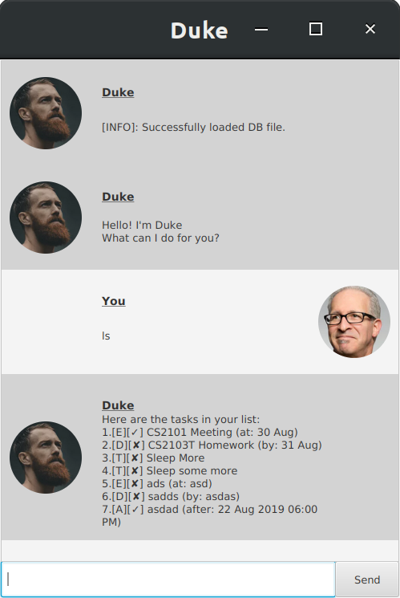

# User Guide

## What is Duke?
Duke is a task management application for anyone who wants to get organised!



## Features

### Manage different types of tasks
In Duke, there are 4 types of tasks:

1. Todo
 - A todo is something you want to do.

1. Deadline
 - A deadline is a task that you need to do before a certain time.

1. Event
 - An event is a task has an event date, so you can remember to attend it.

1. After
 - An After is a task that only needs to be attended to after a certain date. So take a break in the mean time. Take a kitkat!


Each task can be added, marked as done, or removed when you do not need it anymore.

### Better Search
---

You can narrow down the task you're looking for using keywords.

### Friendlier Syntax
---

Ramp up your experience with custom command aliases.
Once you are familiar with the basics, you can assign custom aliases to duke commands to speed up your workflow.

## Usage

---
### `todo <description>` - Adds a Todo

A todo with a short description '<description>', will be added into your task list.

Example of usage (reserved command): 

`todo Sleep more`

Example of usage using alias: 

`t Sleep more`

Expected outcome:

```
Got it. I've added this task:
[T][✘] Sleep more
Now you have 1 tasks in the list.
```

---
### `deadline <description> /by DD/MM/YYYY HHHH` - Adds a Deadline

A deadline with a short description `<description>` and deadline `DD/MM/YYYY HHHH`, will be added into your task list. Note that the time format is in a 24hr format.

Example of usage (reserved command): 

`deadline iP assignment /by 18/09/2019 2359`

Example of usage using alias: 

`d iP assignment /by 18/09/2019 2359`
`due iP assignment /by 18/09/2019 2359`

Expected outcome:

```
Got it. I've added this task:
[D][✘] iP assignment (by: 18 Sep 2019 11:59 PM)
Now you have 2 tasks in the list.
```

---
### `event <description> /at DD/MM/YYYY HHHH` - Adds an Event

An event with a short description `<description>` and event timing `DD/MM/YYYY HHHH`, will be added into your task list. Note that the time format is in a 24hr format.

Example of usage (reserved command): 

`event Time to start crying /at 29/11/2019 0900`

Example of usage using alias:

`e Time to start crying /at 29/11/2019 0900`

Expected outcome:

```
Got it. I've added this task:
[E][✘] Time to start crying (at: 29 Nov 19 09:00 AM)
Now you have 3 tasks in the list.
```

---
### `doafter <description> /after DD/MM/YYYY HHHH` - Adds an Event

A doafter with a short description `<description>` and start timing `DD/MM/YYYY HHHH`, will be added into your task list. Note that the time format is in a 24hr format.

Example of usage (reserved command): 

`doafter Celebrate /after 29/11/2019 1100`

Example of usage using alias:

`after Celebrate /after 29/11/2019 1100`
`a Celebrate /after 29/11/2019 1100`

Expected outcome:

```
Got it. I've added this task:
[A][✘] Celebrate (after: 29 Nov 19 11:00 AM)
Now you have 4 tasks in the list.
```

---
### `list` - List all tasks

All your tasks will be listed

Example of usage (reserved command): 

`list`

Example of usage using alias:

`l`

`ls`

Expected outcome:

```
Here are the tasks in your list:
1. [T][✘] Sleep more
2. [D][✘] iP assignment (by: 18 Sep 2019 11:59 PM)
3. [E][✘] Time to start crying (at: 29 Nov 19 09:00 AM)
4. [A][✘] Celebrate (after: 29 Nov 19 11:00 AM)
```

---
### `done <task number>` - Mark task as done

The task indexed at `<task number>` will be marked as done

Example of usage (reserved command): 

`done 2`

Example of usage using alias:

`m 2`

`mark 2`

Expected outcome:

```
Nice! I've marked this task as done:
[D][✔] iP assignment (by: 18 Sep 2019 11:59 PM)
```

---
### `find <keyword>` - Find tasks using a search keyword

All tasks containing `<keyword>` will be listed.

Example of usage (reserved command): 

`find nov`

Example of usage using alias:

`f nov`

Expected outcome:

```
Here are the matching tasks in your list:
1. [E][✘] Time to start crying (at: 29 Nov 19 09:00 AM)
2. [A][✘] Celebrate (after: 29 Nov 19 11:00 AM)
```

---
### `delete <task number>` - Delete task

The task indexed at `<task number>` will be removed from the list

Example of usage (reserved command): 

`delete 1`

Example of usage using alias:

`rm 1`
`del 1`

Expected outcome:

```
Noted. I've removed this task:
[T][✘] Sleep more
Now you have 3 tasks in the list.
```

---
### `bye` - Save and exit

Save and exit the application by either saying `bye` or click the 'close' window button

Example of usage (reserved command):

`bye`

Example of usage using alias:

`shutdown`

Expected outcome:

```
Bye. Hope to see you again soon!
```

---
### `alias <alias name> <reserved command>` - creates, updates or removes an alias command


Tag an alias name to a reserved command. More specifically, one of the following will happen depending on the parameters of the function. Please note that you can NOT remap a reserved command.

1. a new alias command is created if the alias does not exist

 Example of usage: 

 `alias do todo`

 Expected outcome:

 ```
 Alias 'do' was successfully registered as 
'todo'.
 ```


2. Remaps an existing alias command to a reserved command if the alias exist.

 Example of usage: 

 `alias do deadline`

 Expected outcome:

 ```
 Alias 'do' was successfully updated from 'todo' 
 to 'deadline'.
 ```


3. Unregister an alias if it exist.

 Example of usage: 

 `alias do`

 Expected outcome:

 ```
 Alias 'do' was successfully unregistered.
 ```
